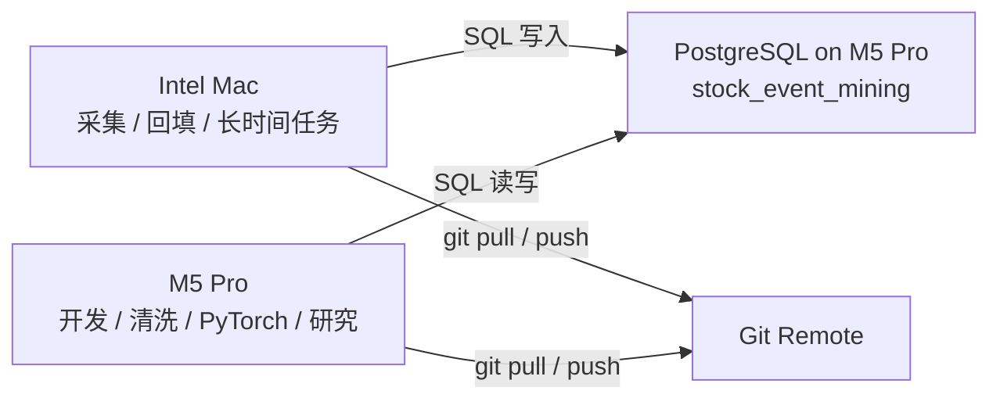
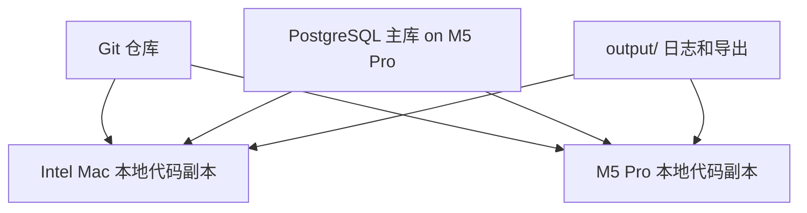
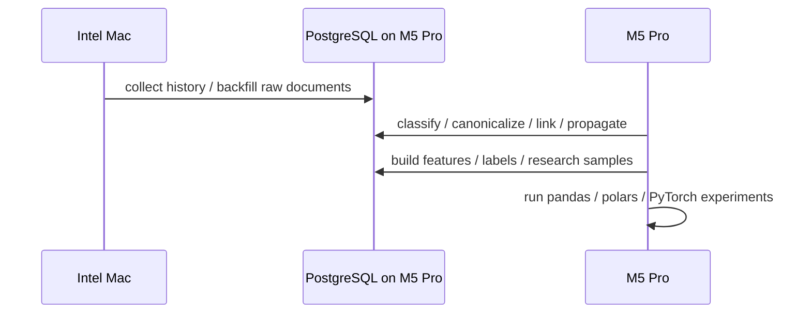

# 双机协作架构说明

这份文档只解决一件事：

**让 Intel 老 Mac 负责采集，M5 Pro 负责 PostgreSQL、开发、数据清洗和深度学习。**

## 结论

推荐方案是：

- **M5 Pro**
  - PostgreSQL 主库
  - 代码开发
  - 数据清洗
  - `events / linking / graph / research / quality`
  - PyTorch / notebook / 实验
- **Intel 老 Mac**
  - 长时间运行采集和正文回填
  - `collect history`
  - `collect backfill-cninfo`

**两台电脑公用一个代码库是不够的。**

还必须同时满足：

1. 两台机器各自有同一个 Git 仓库副本
2. 两台机器都能访问 **同一个 PostgreSQL 主库**
3. 采集和研究使用不同的本地环境与密钥
4. `output/` 不作为事实源，只作为运行产物目录
5. 运行和产物要写 `etl_runs / etl_run_steps / dataset_versions`

## 推荐拓扑



## 角色分工

### Intel 老 Mac

只做网络重、I/O 重、长时运行的任务：

- `./atk collect history ...`
- `./atk collect backfill-cninfo ...`
- 未来的市场数据抓取
- 定时任务或守护进程

不建议在 Intel Mac 上做：

- 结构化事件主流程
- 大量 SQL 分析
- pandas / polars 深度清洗
- PyTorch 训练

### M5 Pro

做数据库、开发和研究：

- PostgreSQL 主库
- 代码开发与重构
- `./atk events run ...`
- `./atk linking run ...`
- `./atk graph run ...`
- `./atk research feature ...`
- `./atk research train-samples ...`
- pandas / polars / DuckDB
- PyTorch / MPS

## 数据和代码分别怎么同步



### Git 负责什么

Git 只负责：

- `src/`
- `sql/`
- `docs/`
- `Makefile`
- `atk`

### PostgreSQL 负责什么

PostgreSQL 是唯一事实源，负责：

- `raw_documents`
- `event_candidates`
- `structured_events`
- `event_company_links`
- `event_propagation_edges`
- `security_features_daily`
- `security_forward_labels_daily`
- `event_research_samples`
- `control_research_samples`
- `etl_runs / etl_run_steps / dataset_versions`

### `output/` 负责什么

`output/` 只负责运行产物：

- 日志
- 中间导出
- 临时 CSV
- 报告

它不是 source of truth，不应该作为双机同步核心。

## 为什么“只共用一个代码库”不够

因为代码同步不能解决这几个问题：

1. **数据一致性**
   - 两台机器如果各写各的本地库，数据会分叉
2. **环境差异**
   - Intel Mac 适合采集
   - M5 Pro 适合分析和训练
3. **密钥与代理**
   - 采集机和研究机不应该共享同一套本地 secrets
4. **运行可审计性**
   - 同一个代码版本，也可能在不同机器产出不同结果

所以正确做法是：

- **代码通过 Git 同步**
- **数据通过 PostgreSQL 主库集中**
- **运行通过 run metadata 记录**

## 推荐的运行流程



## PostgreSQL 放在 M5 Pro 时的关键技术点

### 1. 网络访问

M5 Pro 上的 PostgreSQL 需要允许 Intel Mac 访问。

最少要处理：

- `listen_addresses`
- `pg_hba.conf`
- M5 Pro 防火墙
- 固定局域网 IP 或稳定主机名

建议：

- 只允许局域网内 Intel Mac 的 IP
- 不开放到公网

### 2. 认证

为 Intel Mac 单独建数据库用户，不要直接复用开发主用户。

建议至少区分：

- `collector_runner`
- `research_runner`

这样未来更容易审计和限权。

### 3. M5 Pro 关机问题

如果 PostgreSQL 在 M5 Pro 上：

- M5 Pro 睡眠或关机时
- Intel Mac 的采集写入就会失败

这不是 bug，是架构事实。

所以你需要二选一：

1. 爬虫运行窗口内保持 M5 Pro 常开
2. 未来把 PostgreSQL 迁到独立常驻机器

当前阶段，先接受第 1 条就够了。

## 环境建议

### Intel Mac

保留最小运行环境：

- Python
- PostgreSQL client
- 采集依赖
- `.secrets/` 中仅采集相关 token

### M5 Pro

保留完整研究环境：

- Python
- PostgreSQL client/server
- 数据处理库
- Jupyter / notebook
- PyTorch
- 本地开发工具链

## 目录和文件约定

两台机器都保留同一个 repo 结构，但本地内容职责不同：

- `src/`、`sql/`、`docs/`：都同步
- `.secrets/`：各自本地维护，不进 Git
- `output/`：各自产生日志，不当作同步主对象
- `env/`：各自机器本地环境

## 运行命令建议

### Intel Mac

```bash
./atk collect history DB=stock_event_mining HISTORY_SOURCE=cninfo-disclosure
./atk collect backfill-cninfo DB=stock_event_mining CNINFO_BACKFILL_START=2025-01-01 CNINFO_BACKFILL_END=2026-01-01
```

### M5 Pro

```bash
./atk events run DB=stock_event_mining LIMIT=20
./atk linking run DB=stock_event_mining TOP_K=3 MIN_SCORE=0.35
./atk graph run DB=stock_event_mining MIN_SCORE=0.35
./atk research feature DB=stock_event_mining TIME_BUDGET=300 MAX_ROWS=200
```

## 最小落地方案

如果你现在就要开始双机协作，最小方案是：

1. M5 Pro 上运行 PostgreSQL
2. 两台机器都 clone 同一个 Git 仓库
3. Intel Mac 只跑 `collect`
4. M5 Pro 跑其余所有命令
5. 所有事实数据只写进 M5 Pro 的 `stock_event_mining`
6. `output/` 不同步，只保留本机日志

## 后续可以再补的东西

这份文档故意没展开后续细节，后面再处理：

- PostgreSQL 具体配置步骤
- 定时任务和守护进程
- 局域网 DNS / 固定 IP
- 数据库备份与恢复
- SSH 隧道或局域网 VPN
- 运行资源监控

## 一句话

**可以两台机器共用一个代码库，但这只是最低条件，不是完整方案。**

完整方案应该是：

- **Git 统一代码**
- **M5 Pro 统一 PostgreSQL**
- **Intel Mac 专职采集**
- **M5 Pro 专职研究和训练**
- **运行产物和审计写进数据库，而不是靠 `output/` 互拷**
