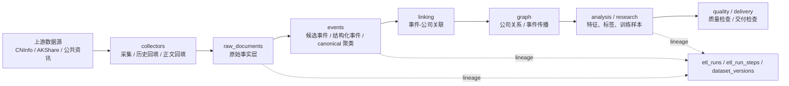
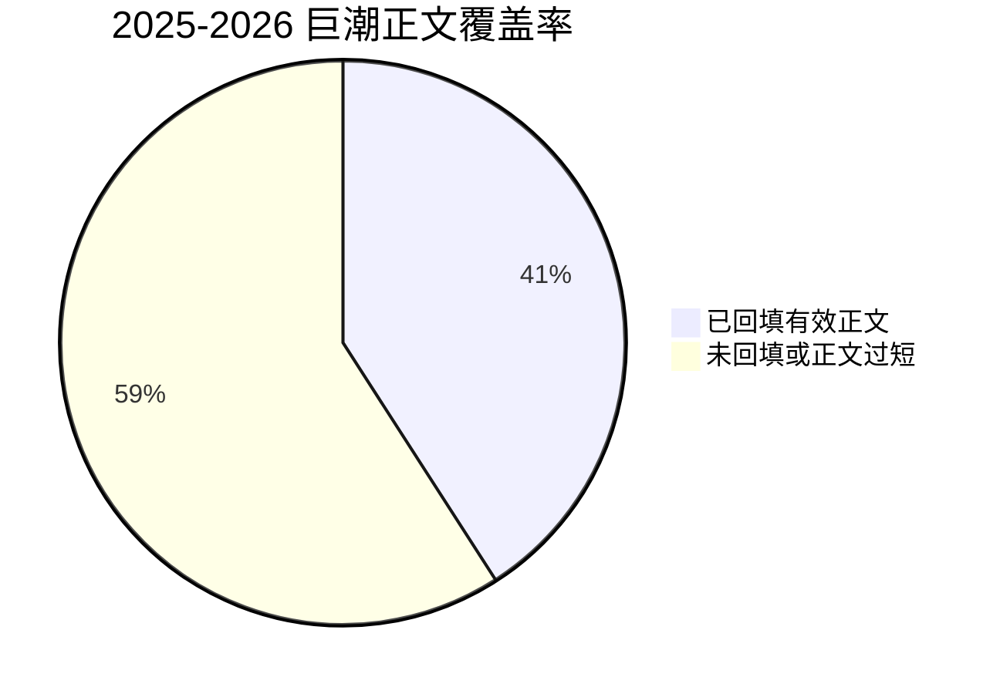
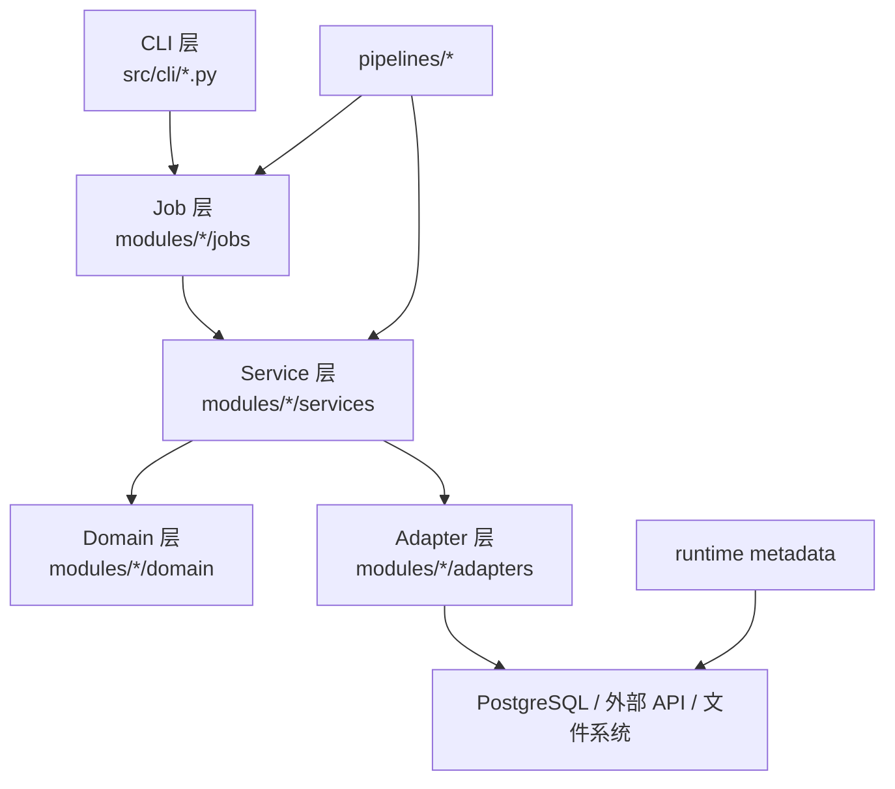
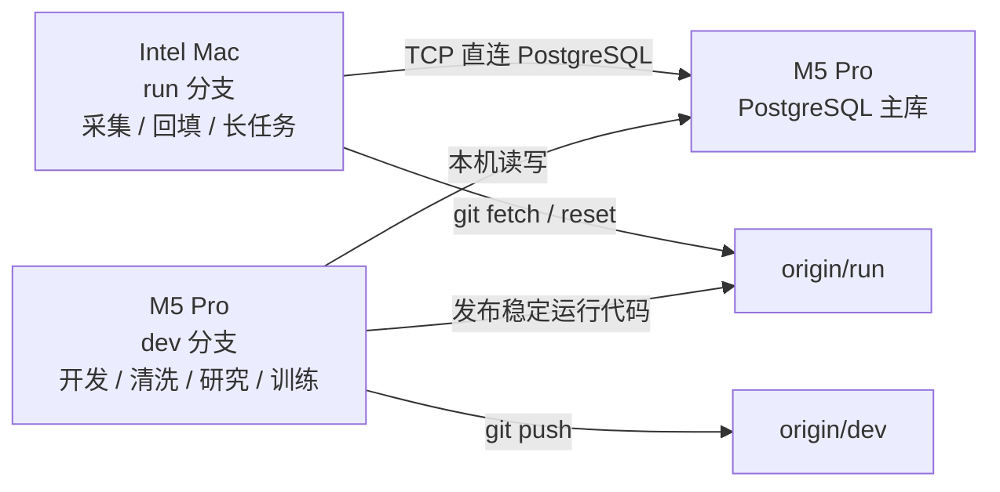
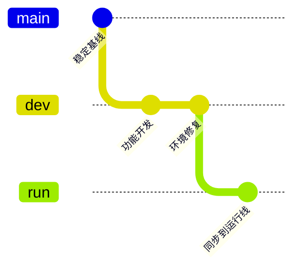

# 股市预测模型

> 一个以 PostgreSQL 为中心的数据底座、以事件为主轴的研究型量化平台。  
> 当前系统已经完成从“脚本集合”到“可持续回填、可复算、可研究、可双机协作”的工程化转向。

## 摘要

本项目围绕 A 股公开信息流构建事件驱动研究基础设施，核心目标不是生成一次性的比赛结果，而是形成一套可长期迭代的数据与研究系统：

- 持续采集公告与资讯文本
- 将原始文本标准化为结构化事件
- 建立事件到公司的关联与传播关系
- 生成可研究、可训练、可追溯的数据集
- 支持双机协作：`M5 Pro` 负责数据库、开发、研究与训练，`Intel Mac` 负责长时间采集与正文回填

这套系统的核心约束是：**数据库是唯一事实源，Git 只同步代码，`output/` 只保存运行产物。**

---

## 一、项目全景



### 当前定位

| 维度 | 当前状态 |
|---|---|
| 项目类型 | 事件驱动量化研究平台 |
| 主数据库 | `stock_event_mining` |
| 主代码分支 | `dev` |
| 运行分支 | `run` |
| 运行拓扑 | `M5 Pro (DB/研究)` + `Intel Mac (采集/回填)` |
| 主入口 | `./SPM` 与 `src/cli/*.py` |
| 当前阶段 | 数据底座与研究底座已经成形，仍在继续提高正文覆盖率与研究完整度 |

---

## 二、当前项目状态

### 1. 数据库状态快照

更新时间：`2026-04-22`

| 表/主题 | 当前规模 |
|---|---:|
| `raw_documents` | 1,577,640 |
| `event_candidates` | 1,577,638 |
| `structured_events` | 370,135 |
| `canonical_event_clusters` | 106,760 |
| `canonical_event_memberships` | 332,660 |
| `company_relations` | 205 |
| `company_profiles` | 136 |
| `stock_daily_quotes` | 78,596 |
| `market_environment_daily` | 1,494 |
| `sentiment_propagation_daily` | 428 |
| `security_features_daily` | 78,770 |
| `security_forward_labels_daily` | 78,770 |
| `event_research_samples` | 538 |
| `control_research_samples` | 36,377 |
| `etl_runs` | 37 |
| `etl_run_steps` | 8 |

### 2. 2025-2026 巨潮正文回填进度

| 指标 | 数值 |
|---|---:|
| 2025-2026 巨潮历史公告总量 | 517,570 |
| 有效正文条数 | 211,701 |
| 有效正文覆盖率 | 40.90% |
| 命中 `12000` 字截断上限 | 17,903 |



### 3. 当前工程判断

- **链路已跑通**：Intel 已能通过 TCP 直连 M5 上 PostgreSQL，并完成正文回填写库
- **环境已分层**：M5 使用 `spm-m5pro` Conda 环境，Intel 使用 `.venv`
- **Git 结构已收敛**：只保留 `dev` 与 `run`
- **正文回填可用**：Intel 已不再强依赖 `pdftotext`，缺失时可回退到 `pdfplumber`
- **主要短板仍在数据覆盖率**：正文回填整体可用，但 2025-2026 覆盖率仍需继续提升

---

## 三、系统架构

### 1. 代码分层



### 2. 领域模块

| 模块 | 角色 |
|---|---|
| `src/modules/collectors/` | 实时采集、历史采集、正文回填 |
| `src/modules/events/` | 候选事件、结构化事件、canonical 聚类 |
| `src/modules/companies/` | 公司主数据、画像、行业与市场补充数据 |
| `src/modules/linking/` | 事件-公司链接 |
| `src/modules/graph/` | 公司关系与传播链 |
| `src/modules/analysis/` | 事件研究、负样本、训练样本 |
| `src/modules/quality/` | 质量检查、存储治理、交付检查 |
| `src/modules/runtime/` | 运行元数据、数据集 lineage、数据库连接 |

### 3. 数据分层

| 层级 | 主表 |
|---|---|
| 原始事实层 | `raw_documents`, `stock_daily_quotes`, `market_environment_daily`, `sentiment_propagation_daily` |
| 事件标准化层 | `event_candidates`, `structured_events`, `canonical_event_clusters`, `canonical_event_memberships` |
| 公司与关系层 | `companies`, `company_profiles`, `event_company_links`, `company_relations`, `event_propagation_edges` |
| 研究样本层 | `security_features_daily`, `security_forward_labels_daily`, `event_research_samples`, `control_research_samples` |
| 治理层 | `etl_runs`, `etl_run_steps`, `dataset_versions` |

详细说明见 [docs/database_model.md](/Users/tim/股市预测模型/docs/database_model.md)。

---

## 四、双机协作体系

### 1. 当前正式协作模式



### 2. 职责边界

| 机器 | 角色 | 环境 | 默认分支 |
|---|---|---|---|
| M5 Pro | PostgreSQL 主库、开发、清洗、研究、训练 | `conda activate spm-m5pro` | `dev` |
| Intel Mac | 采集、历史回填、正文回填、长时间运行任务 | `source .venv/bin/activate` | `run` |

### 3. Git 工作流



实际约束是：

- `dev` 用于开发和结构调整
- `run` 用于 Intel 上的稳定执行
- Intel 不承担主开发职责
- 数据库不靠 Git 同步，仍只认 M5 上 PostgreSQL 主库

完整说明见 [DUAL_MACHINE_ARCHITECTURE.md](/Users/tim/股市预测模型/DUAL_MACHINE_ARCHITECTURE.md)。

---

## 五、运行入口

### 推荐入口

```bash
./SPM help
python3 src/cli/collect.py --help
python3 src/cli/events.py --help
python3 src/cli/linking.py --help
python3 src/cli/graph.py --help
python3 src/cli/research.py --help
python3 src/cli/quality.py --help
make help
```

### 最常用命令

#### 采集与正文回填

```bash
python3 src/cli/collect.py collect-history --db stock_event_mining --source cninfo-disclosure
python3 src/cli/collect.py backfill-cninfo-fulltext --db stock_event_mining --start-date 2025-01-01 --end-date 2026-12-31
```

#### 事件标准化

```bash
python3 src/cli/events.py run --db stock_event_mining --limit 8
python3 src/cli/events.py classify-pending --db stock_event_mining --batch-size 2000 --max-batches 1
```

#### 事件-公司关联与传播

```bash
python3 src/cli/linking.py run --db stock_event_mining --top-k 3 --min-score 0.35
python3 src/cli/graph.py run --db stock_event_mining --input output/seeds/company_relations_seed.csv
```

#### 研究与质量

```bash
python3 src/cli/research.py feature --db stock_event_mining --analysis-mode event-study --benchmark hs300
python3 src/cli/quality.py db-status --db stock_event_mining
python3 src/cli/quality.py qa --db stock_event_mining
```

---

## 六、环境策略

### M5 Pro

- 环境名：`spm-m5pro`
- 环境文件：[environment.m5pro.yml](/Users/tim/股市预测模型/environment.m5pro.yml)
- 适用范围：开发、数据处理、研究、深度学习

```bash
conda activate spm-m5pro
conda env update -n spm-m5pro -f environment.m5pro.yml
```

### Intel Mac

- 运行环境：仓库内 `.venv`
- 适用范围：采集、正文回填、入库
- 不强求全量研究依赖与 M5 完全同构

```bash
python3 -m venv .venv
source .venv/bin/activate
uv pip install requests aiohttp akshare pandas psycopg pdfplumber python-dotenv beautifulsoup4 lxml openpyxl html5lib
```

---

## 七、已解决的关键工程问题

| 问题 | 现象 | 当前处理 |
|---|---|---|
| 数据库连接写死本机 | Intel 只能靠 SSH tunnel 假装 localhost | `dsn_for()` 已支持环境变量与 DSN |
| Intel 上 `pdftotext` 依赖脆弱 | `poppler` 安装困难，正文回填卡死 | 先找 `pdftotext`，找不到自动回退 `pdfplumber` |
| 运行元数据建表权限问题 | `collector_runner` 不是 `etl_runs` owner，回填启动失败 | 若表已存在则跳过 DDL，只保留写入 run metadata |
| Intel 无法安装全量研究依赖 | `onnxruntime` 在 macOS 13 x86_64 无可用 wheel | Intel 改用“最小采集依赖”，研究依赖留给 M5 |
| 分支与 worktree 过多 | 开发线、运行线、旧分支混杂 | 收敛为 `dev` / `run` 两条分支 |

更多细节见 [docs/KNOWN_ISSUES.md](/Users/tim/股市预测模型/docs/KNOWN_ISSUES.md)。

---

## 八、当前限制

当前系统已经可以支持：

- 原始文本采集与历史补数
- 正文回填
- 事件结构化
- 事件-公司映射
- 传播图谱生成
- 基础事件研究与样本构建
- 运行元数据记录

但它还**不是**：

- 完整交易执行系统
- 高频回测平台
- 自动化生产调度平台
- 已完成所有点时研究数据补齐的成熟研究仓库

---

## 九、文档地图

建议阅读顺序：

1. [docs/README.md](/Users/tim/股市预测模型/docs/README.md)
2. [DUAL_MACHINE_ARCHITECTURE.md](/Users/tim/股市预测模型/DUAL_MACHINE_ARCHITECTURE.md)
3. [docs/PROJECT_STATUS.md](/Users/tim/股市预测模型/docs/PROJECT_STATUS.md)
4. [docs/TECH_STACK.md](/Users/tim/股市预测模型/docs/TECH_STACK.md)
5. [docs/KNOWN_ISSUES.md](/Users/tim/股市预测模型/docs/KNOWN_ISSUES.md)
6. [docs/database_model.md](/Users/tim/股市预测模型/docs/database_model.md)
7. [docs/architecture_review.md](/Users/tim/股市预测模型/docs/architecture_review.md)
8. [docs/engineering_backlog.md](/Users/tim/股市预测模型/docs/engineering_backlog.md)

---

## 十、结论

这不是一个“等所有功能补完再开始研究”的项目。  
它已经具备了可运行的工程内核：

- 有中心化数据库事实源
- 有双机协作模型
- 有可追踪的运行元数据
- 有稳定的 CLI 入口
- 有持续可提升的正文资产

接下来真正决定系统上限的，不再是“能不能跑”，而是：

1. 正文覆盖率能否继续上升  
2. 点时特征与标签能否继续补齐  
3. 研究样本与传播链是否足够稳定、可复算、可解释
