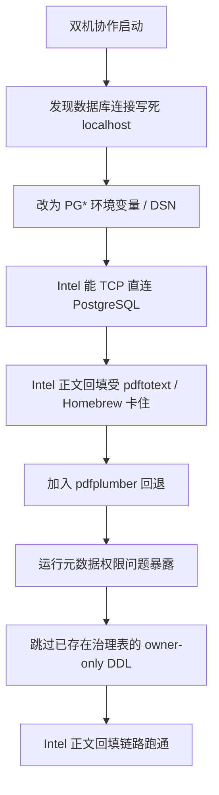

# 已知问题与处置记录

这份文档不记录抽象风险，只记录**项目实际遇到过的问题、根因和当前处理方式**。

## 一、已经解决的问题

| 问题 | 现象 | 根因 | 当前处理 |
|---|---|---|---|
| 数据库连接写死 localhost | Intel 必须靠 SSH tunnel 假装本机 | `dsn_for()` 固定返回 `127.0.0.1` | 改成支持 `STOCK_EVENT_MINING_DSN` 与 `PG*` 环境变量 |
| Intel 无法跑正文回填 | `pdftotext` 在 Intel 上难安装或路径不兼容 | 代码写死 `/opt/homebrew/bin/pdftotext` | 优先自动找 `pdftotext`，找不到时回退到 `pdfplumber` |
| Intel 回填启动时报 schema 权限错误 | `permission denied for schema public` | 运行元数据初始化需要建表 | 已授予 `collector_runner` 对 `public` 的必要权限 |
| Intel 回填又报 owner 错误 | `must be owner of table etl_runs` | 每次运行都在执行建表 DDL，非 owner 也去触发表/索引创建 | 先检查治理表是否已存在；已存在则跳过 DDL |
| Intel 全量装依赖失败 | `onnxruntime` 在 macOS 13 x86_64 无 wheel | Intel 本来不适合承担全量研究依赖 | Intel 改成最小采集依赖策略，M5 保留全量环境 |
| Git 分支与 worktree 过多 | `main/dev/run/backup` 混在一起 | 历史分支残留与旧 worktree 未清理 | 收敛到 `dev` / `run` 两分支，并清理 stale worktree |
| M5 运行环境不清晰 | 实际跑的是 Homebrew 全局 Python | 仓库内旧 `env/` 不再是事实环境，但仍残留 | 建立 `spm-m5pro`，删除旧 repo-local env |

## 二、当前仍存在的问题

| 问题 | 当前状态 | 影响 |
|---|---|---|
| 2025-2026 正文覆盖率仍偏低 | 当前约 40.90% | 会限制事件文本质量和后续研究样本质量 |
| 一部分正文命中 12000 字截断 | 已填充正文中约 8.46% 命中上限 | 长文档会丢失尾部信息 |
| `dataset_versions` 规模仍很小 | 当前为 0 | 数据集 lineage 尚未形成稳定使用习惯 |
| 传播图谱规模较小 | `company_relations` 当前为 205 | 传播推断覆盖面有限 |
| 研究层表规模仍偏初期 | 样本量已形成，但仍不算大 | 训练与验证空间还有限 |

## 三、问题时间线

## 四、当前建议处理顺序

### 最高优先级

1. 继续提升 2025-2026 正文覆盖率
2. 观察正文过短与截断比例
3. 让 `dataset_versions` 真正进入日常使用

### 次优先级

1. 扩展市场与公司维度特征
2. 补强传播边与公司关系边
3. 压缩 legacy 桥接层

## 五、判断标准

### 什么叫“问题已解决”

- 不是“某次手工 workaround 成功”
- 而是“系统默认路径下无需额外手工补丁即可运行”

### 目前哪些算真正解决

- 数据库连接层
- Intel 正文回填路径
- 运行元数据 owner-only DDL 问题
- M5 主环境事实源
- Git 分支结构混乱

### 哪些还只是“阶段性可用”

- 正文覆盖率
- 研究样本层规模
- 传播图谱规模
- 数据集版本治理
