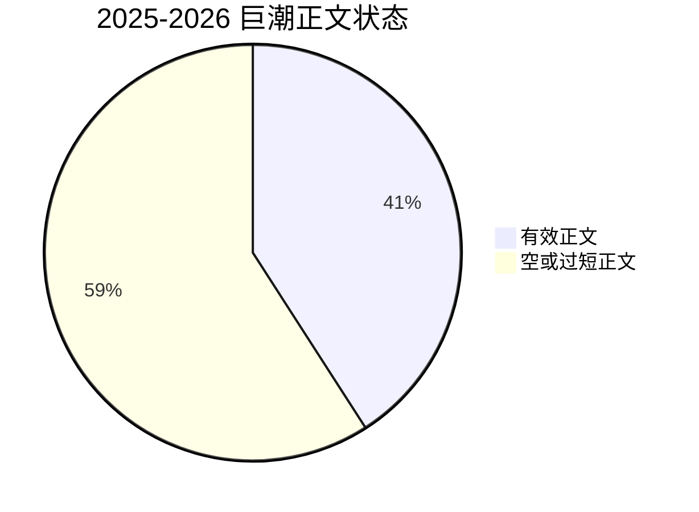

# 项目状态总览

更新时间：`2026-04-22`

## 总结

当前项目已经具备稳定的工程主干：

- 以 `stock_event_mining` 为唯一数据库事实源
- 以 `dev` / `run` 两分支支撑开发与运行分离
- 以 `M5 Pro + Intel Mac` 支撑双机协作
- 以 `etl_runs / etl_run_steps / dataset_versions` 支撑运行治理

但项目仍处于“数据底座持续做实”的阶段，最主要的工作仍是：

1. 提高正文回填覆盖率
2. 继续补齐研究底座的点时特征与标签
3. 持续验证研究与传播链路的稳定性

## 状态看板

| 项目面向 | 当前状态 | 判断 |
|---|---|---|
| 数据采集 | 可用 | 已能采集与历史回填 |
| 正文回填 | 可用但未覆盖完全 | Intel 已跑通，整体覆盖率仍需继续提高 |
| 事件标准化 | 可用 | 候选事件和结构化事件主链已成形 |
| 事件-公司关联 | 可用 | 主链命令已稳定存在 |
| 传播图谱 | 初步可用 | 仍偏轻量，图关系规模不大 |
| 研究样本 | 初步可用 | 已能生成样本，但规模和字段还可继续补强 |
| 运行治理 | 已建立 | run metadata 与 dataset lineage 已接入主链 |
| 双机协作 | 已跑通 | TCP 直连 PostgreSQL 已验证成功 |

## 核心数据库快照

来自 `python3 src/cli/quality.py db-status --db stock_event_mining`：

| 表 | 行数 |
|---|---:|
| `raw_documents` | 1,577,640 |
| `event_candidates` | 1,577,638 |
| `structured_events` | 370,135 |
| `canonical_event_clusters` | 106,760 |
| `canonical_event_memberships` | 332,660 |
| `company_relations` | 205 |
| `company_profiles` | 136 |
| `stock_daily_quotes` | 78,596 |
| `market_environment_daily` | 1,494 |
| `sentiment_propagation_daily` | 428 |
| `security_features_daily` | 78,770 |
| `security_forward_labels_daily` | 78,770 |
| `event_research_samples` | 538 |
| `control_research_samples` | 36,377 |
| `etl_runs` | 37 |
| `etl_run_steps` | 8 |
| `dataset_versions` | 0 |

## 2025-2026 巨潮正文状态

| 指标 | 数值 |
|---|---:|
| 2025-2026 巨潮历史公告总量 | 517,570 |
| 已回填有效正文 | 211,701 |
| 回填覆盖率 | 40.90% |
| 命中 `12000` 字上限 | 17,903 |

### 正文长度分布

| 分位点 | 长度 |
|---|---:|
| 最小值 | 51 |
| P25 | 1,324 |
| 中位数 | 2,839 |
| P75 | 5,240 |
| P95 | 12,000 |
| 最大值 | 12,000 |

这说明：

- 大部分已抽取正文不是空壳
- 但一部分文档被当前 `12000` 字上限截断
- 覆盖率仍明显低于最终可接受水平

## 环境状态

### M5 Pro

| 项目 | 当前状态 |
|---|---|
| 主角色 | 数据库主库、开发、清洗、研究、训练 |
| Python 环境 | `spm-m5pro` |
| 环境管理 | Conda |
| 环境定义文件 | [environment.m5pro.yml](/Users/tim/股市预测模型/environment.m5pro.yml) |

### Intel Mac

| 项目 | 当前状态 |
|---|---|
| 主角色 | 采集、历史回填、正文回填 |
| Python 环境 | 仓库内 `.venv` |
| 环境管理 | `venv` + `uv` |
| 依赖策略 | 最小采集依赖，不强行安装全量研究依赖 |

## Git 状态

| 项目 | 当前状态 |
|---|---|
| 主开发分支 | `dev` |
| 主运行分支 | `run` |
| 当前提交 | `6c5d49f` |
| 远端分支 | `origin/dev`, `origin/run` |
| 已清理分支 | `main`, `backup/run-pre-sync-20260404` |

## 当前最重要的结论

### 已经成立的事实

- Intel 已能通过 TCP 直连 M5 上 PostgreSQL
- Intel 已能在 `run` 分支执行正文回填
- `collector_runner` 已能正常写运行元数据，不再被 owner-only DDL 卡住
- 项目环境已经分层：M5 负责全量研究环境，Intel 负责轻量运行环境

### 还未完成的事情

- 2025-2026 正文覆盖率仍然偏低
- `dataset_versions` 尚未形成稳定产物登记规模
- 传播图谱与研究样本层仍有进一步扩展空间
- 市场与基本面维度仍需要继续补齐

## 当前建议

### 短期

1. 继续在 Intel 上推进 2025-2026 正文回填
2. 稳定跑 `collect -> events -> linking -> quality` 的小批量 smoke test
3. 持续观察 `etl_runs` 与 `etl_run_steps` 的 run 记录完整性

### 中期

1. 提高正文覆盖率并评估 `12000` 截断上限是否需要上调
2. 扩展 `security_features_daily` 的研究字段
3. 增强 `company_relations` 和 `event_propagation_edges` 的规模与质量

### 长期

1. 形成更稳定的研究训练数据集版本体系
2. 建立更明确的迁移治理和调度治理
3. 让双机协作从“可用”提升到“长期稳定运行”
