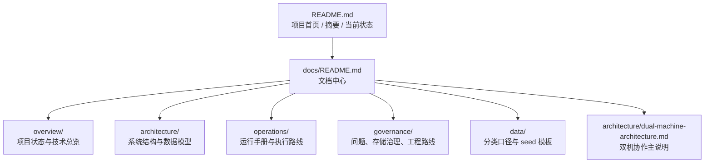

# 文档中心

`docs/` 现在不再是平铺的 Markdown 堆，而是按职责分层的文档系统。

这份索引页回答四件事：

1. 文档现在分成了哪些类别
2. 每个目录到底负责什么
3. 初次进入项目应该先看什么
4. 哪些文档是状态、哪些是架构、哪些是操作手册

## 文档拓扑

## 目录说明

| 目录 | 作用 | 你什么时候该看 |
|---|---|---|
| [overview/](overview/README.md) | 项目现状、技术栈、环境和入口 | 先理解项目是什么、当前到了哪一步 |
| [architecture/](architecture/README.md) | 系统结构、数据模型、双机架构关联 | 想看模块边界、数据库层次、架构演化 |
| [operations/](operations/README.md) | 日常运行、回填、冻结期、无 Tushare 路线 | 想真正执行任务、排障或交付 |
| [governance/](governance/README.md) | 已知问题、空间治理、工程优先级 | 想知道坑点、约束和下一步做什么 |
| [data/](data/README.md) | 分类口径、seed 模板、数据补录说明 | 想补数据、理解交付字段或准备 seed |

## 推荐阅读顺序

### 1. 第一次进入项目

1. [README.md](../README.md)
2. [overview/project-status.md](overview/project-status.md)
3. [overview/tech-stack.md](overview/tech-stack.md)
4. [architecture/system-architecture.md](architecture/system-architecture.md)
5. [operations/runbook.md](operations/runbook.md)

### 2. 想理解双机协作和运行分工

1. [architecture/dual-machine-architecture.md](architecture/dual-machine-architecture.md)
2. [operations/runbook.md](operations/runbook.md)
3. [governance/known-issues.md](governance/known-issues.md)
4. [governance/engineering-roadmap.md](governance/engineering-roadmap.md)

### 3. 想快速找某份文档的用途

| 文档 | 作用 |
|---|---|
| [overview/project-status.md](overview/project-status.md) | 今天的系统快照，包含数据库规模、回填进度、分支状态 |
| [overview/tech-stack.md](overview/tech-stack.md) | 技术栈、目录、运行环境、模块边界 |
| [architecture/system-architecture.md](architecture/system-architecture.md) | 架构优缺点、当前边界、演进方向 |
| [architecture/database-model.md](architecture/database-model.md) | 核心数据表和数据层次 |
| [operations/runbook.md](operations/runbook.md) | 每天实际执行命令和检查命令 |
| [operations/no-tushare-workflow.md](operations/no-tushare-workflow.md) | 无 Tushare 时怎么跑完整数据路线 |
| [operations/delivery-freeze-runbook.md](operations/delivery-freeze-runbook.md) | 冻结期能做什么、不能做什么 |
| [governance/known-issues.md](governance/known-issues.md) | 已踩过的坑、根因和当前解法 |
| [governance/storage-retention-policy.md](governance/storage-retention-policy.md) | 哪些表占空间、哪些表能删、哪些不能碰 |
| [governance/engineering-roadmap.md](governance/engineering-roadmap.md) | 今天真正值得做的事 |
| [data/classification-contract.md](data/classification-contract.md) | 交付分类口径与字段契约 |
| [data/templates/README.md](data/templates/README.md) | 所有 seed 模板的目录和说明 |

## 命名约定

文档目录现在遵守两条规则：

- 目录名表达职责：`overview / architecture / operations / governance / data`
- 文件名表达用途：`project-status / runbook / known-issues / database-model`

也就是说，今后默认避免：

- 含糊的 `review / backlog / policy / workflow` 平铺堆在根目录
- 只有作者自己知道用途的文件名

## 当前维护原则

- `README.md`：面向项目整体，像论文首页一样给出摘要和全景
- `docs/README.md`：面向文档系统本身，负责导航和分层
- 各分类目录的 `README.md`：负责解释该目录下的文档职责
- 业务文档：只讲一个主题，不兼做索引页
