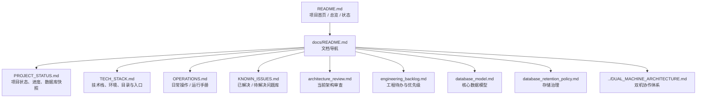

# 文档总览

这份索引页负责回答三件事：

1. 这个项目现在到底是什么
2. 项目文档应该从哪里开始看
3. 哪些文档讲“结构”，哪些文档讲“状态”，哪些文档讲“操作”

## 文档地图

## 推荐阅读顺序

### 1. 初次进入项目

如果你要快速理解项目全貌，按这个顺序看：

1. [README.md](/Users/tim/股市预测模型/README.md)
2. [PROJECT_STATUS.md](/Users/tim/股市预测模型/docs/PROJECT_STATUS.md)
3. [TECH_STACK.md](/Users/tim/股市预测模型/docs/TECH_STACK.md)
4. [OPERATIONS.md](/Users/tim/股市预测模型/docs/OPERATIONS.md)
5. [database_model.md](/Users/tim/股市预测模型/docs/database_model.md)

### 2. 关注双机协作与运行

1. [../DUAL_MACHINE_ARCHITECTURE.md](/Users/tim/股市预测模型/DUAL_MACHINE_ARCHITECTURE.md)
2. [OPERATIONS.md](/Users/tim/股市预测模型/docs/OPERATIONS.md)
3. [KNOWN_ISSUES.md](/Users/tim/股市预测模型/docs/KNOWN_ISSUES.md)
4. [engineering_backlog.md](/Users/tim/股市预测模型/docs/engineering_backlog.md)

### 3. 关注工程治理

1. [architecture_review.md](/Users/tim/股市预测模型/docs/architecture_review.md)
2. [engineering_backlog.md](/Users/tim/股市预测模型/docs/engineering_backlog.md)
3. [database_retention_policy.md](/Users/tim/股市预测模型/docs/database_retention_policy.md)

## 文档分层

| 层级 | 文档 | 作用 |
|---|---|---|
| 首页层 | [README.md](/Users/tim/股市预测模型/README.md) | 面向项目整体的专业化总览 |
| 状态层 | [PROJECT_STATUS.md](/Users/tim/股市预测模型/docs/PROJECT_STATUS.md) | 记录当前数据库、环境、分支、回填进度与实际状态 |
| 技术层 | [TECH_STACK.md](/Users/tim/股市预测模型/docs/TECH_STACK.md) | 解释模块、入口、环境与依赖策略 |
| 操作层 | [OPERATIONS.md](/Users/tim/股市预测模型/docs/OPERATIONS.md) | 日常启动、同步、回填、检查和排障手册 |
| 问题层 | [KNOWN_ISSUES.md](/Users/tim/股市预测模型/docs/KNOWN_ISSUES.md) | 记录遇到过的问题、根因与当前处置 |
| 架构层 | [architecture_review.md](/Users/tim/股市预测模型/docs/architecture_review.md) | 审视架构成熟度、边界与演进方向 |
| 规划层 | [engineering_backlog.md](/Users/tim/股市预测模型/docs/engineering_backlog.md) | 当前 backlog、优先级和执行顺序 |
| 数据层 | [database_model.md](/Users/tim/股市预测模型/docs/database_model.md) | 数据分层与主表语义 |

## 当前文档约束

- `README.md` 必须反映项目真实状态，而不是理想状态
- `PROJECT_STATUS.md` 记录的是“今天”的系统快照
- `TECH_STACK.md` 描述“如何组成”
- `KNOWN_ISSUES.md` 描述“踩过哪些坑、现在怎么处理”
- `engineering_backlog.md` 只写还没完成、但值得做的事情

## 当前一句话总结

这个项目已经不是“收集一些脚本去跑公告”的仓库，而是一套围绕 `PostgreSQL + 事件链路 + 双机协作 + 研究样本` 组织起来的工程化研究系统。
