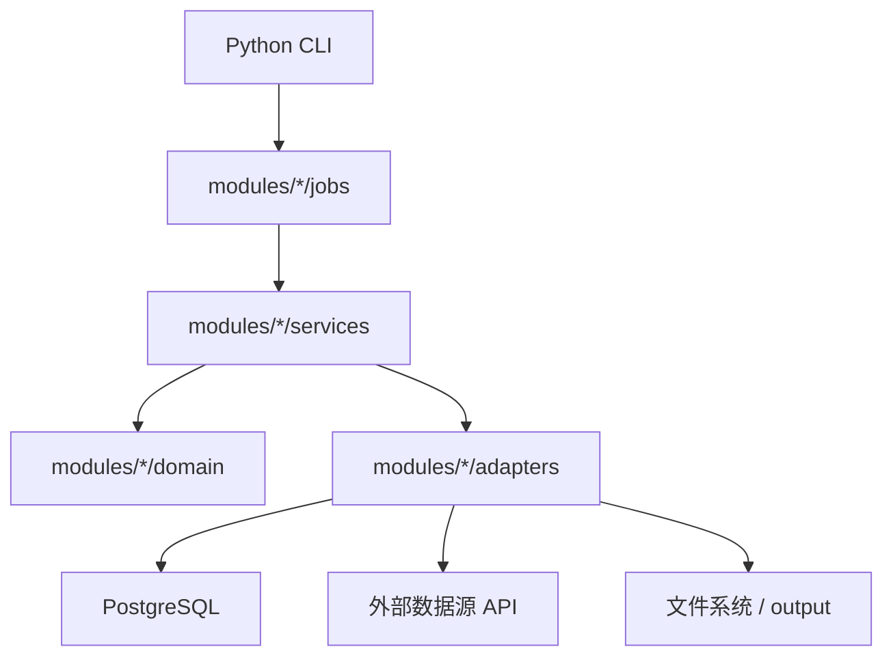

# 技术栈与工程分层

## 总体设计

本项目采用的是“**数据库中心化 + Python CLI 领域入口 + 模块化服务层 + 双环境策略**”。



## 语言与运行时

| 类别 | 选择 |
|---|---|
| 主语言 | Python |
| 数据库 | PostgreSQL 15 |
| 包管理 | `pip` / `uv` / Conda |
| Intel 运行环境 | `venv` |
| M5 研究环境 | Conda `spm-m5pro` |
| 数据库驱动 | `psycopg` |

## 代码结构

### CLI 层

| 文件 | 职责 |
|---|---|
| `src/cli/collect.py` | 采集、历史回填、正文回填 |
| `src/cli/events.py` | 事件分类、归一化、canonical load |
| `src/cli/linking.py` | 公司主数据、画像、事件-公司链接 |
| `src/cli/graph.py` | 公司关系与传播边生成 |
| `src/cli/research.py` | 特征、训练样本、负样本 |
| `src/cli/quality.py` | 质量检查、存储治理、交付状态 |

### 模块层

| 目录 | 职责 |
|---|---|
| `src/modules/collectors/` | 数据采集和正文提取 |
| `src/modules/events/` | 事件候选与结构化事件处理 |
| `src/modules/companies/` | 公司主数据与相关画像/统计补充 |
| `src/modules/linking/` | 事件链接到公司 |
| `src/modules/graph/` | 关系图和传播图 |
| `src/modules/analysis/` | 研究样本与分析产物 |
| `src/modules/quality/` | 数据质量、交付与存储治理 |
| `src/modules/runtime/` | 数据库连接、run metadata、dataset lineage |

### 兼容层

| 目录 | 状态 |
|---|---|
| `src/capabilities/analysis` | 仍有 legacy 兼容逻辑 |
| `src/capabilities/storage` | 仍有桥接逻辑 |
| `src/capabilities/rag` | RAG 相关旧实现仍在，但不是主链 |

## 数据栈

| 层级 | 主体 |
|---|---|
| 原始数据层 | `raw_documents`, `stock_daily_quotes`, `market_environment_daily` |
| 事件层 | `event_candidates`, `structured_events`, `canonical_event_clusters` |
| 关联层 | `event_company_links`, `company_relations`, `event_propagation_edges` |
| 研究层 | `security_features_daily`, `security_forward_labels_daily`, `event_research_samples` |
| 治理层 | `etl_runs`, `etl_run_steps`, `dataset_versions` |

## 外部依赖

### 数据来源

| 来源 | 用途 |
|---|---|
| CNInfo / 巨潮资讯 | 历史公告、PDF 正文回填 |
| AKShare | 公共市场与公司数据补充 |
| Tushare | 可选的证券数据扩展 |
| 公开资讯站点 | 事件来源补充 |

### 本地工具

| 工具 | 用途 |
|---|---|
| `psql` | 数据库验证与只读查询 |
| `uv` | Intel 上快速安装 Python 依赖 |
| `conda` | M5 上管理研究环境 |
| `Makefile` / `SPM` | 统一命令入口 |

## 环境策略

### 为什么 M5 用 Conda

- 需要承担更重的研究与训练任务
- 需要更稳定地管理数值、模型和实验依赖
- 不想继续依赖 Homebrew 全局 Python 作为事实运行环境

### 为什么 Intel 用 `venv`

- Intel 的职责是采集与回填，不是全功能研究工作站
- 安装和维护 Conda 的成本明显更高
- Intel 上部分研究型依赖没有合适的 wheel，例如某些 `onnxruntime` 版本
- `venv + uv` 更适合轻量执行节点

## 入口策略

### 用户入口

```bash
./SPM help
```

### 领域入口

```bash
python3 src/cli/collect.py --help
python3 src/cli/events.py --help
python3 src/cli/linking.py --help
python3 src/cli/graph.py --help
python3 src/cli/research.py --help
python3 src/cli/quality.py --help
```

## 当前技术判断

### 已经比较成熟的部分

- CLI 分层
- 领域模块边界
- PostgreSQL 中心化事实源
- 双环境策略
- 运行元数据基本治理

### 仍处在迭代中的部分

- 正文覆盖率
- 传播图谱规模
- 研究样本丰富度
- 数据集版本治理
- legacy `capabilities/*` 的进一步收缩
