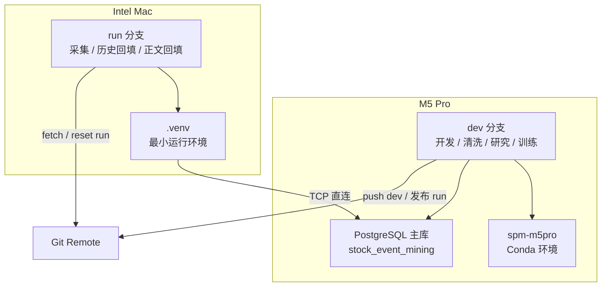
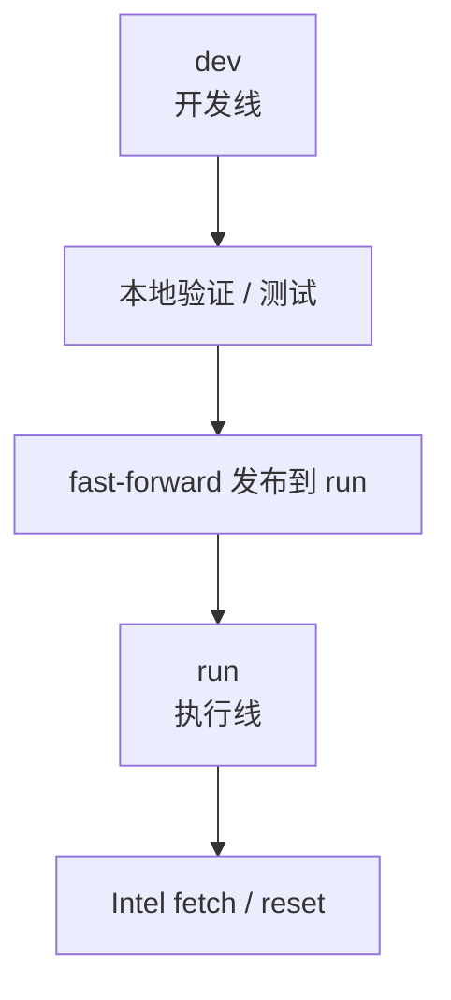

# 双机协作架构

这份文档只回答一个问题：

**在当前项目里，M5 Pro 和 Intel Mac 分别负责什么，系统边界在哪里，以及这套双机方案真正成立的前提是什么。**

## 摘要

当前正式架构不是“共享数据库文件的双机系统”，而是：

- `M5 Pro` 持有唯一 PostgreSQL 主库
- `Intel Mac` 通过 TCP 直连 PostgreSQL
- `Git` 只同步代码，不同步数据库状态
- `output/` 只保存运行产物，不作为事实源
- `etl_runs / etl_run_steps / dataset_versions` 负责记录运行和产物 lineage

一句话概括：

> **单主库、双机分工、网络直连、代码与数据分离。**

## 一、当前正式拓扑

## 二、角色分工

### M5 Pro

负责：

- PostgreSQL 主库
- `dev` 分支开发
- 数据清洗与结构化处理
- `events / linking / graph / research / quality`
- notebook、特征工程、深度学习

使用环境：

- `conda activate spm-m5pro`

### Intel Mac

负责：

- 长时间采集
- 历史回填
- CNInfo 正文回填
- 稳定运行型任务

使用环境：

- `source .venv/bin/activate`

默认分支：

- `run`

## 三、这套方案能做到什么

当前正式架构已经能稳定做到：

1. Intel 采集和回填，直接写入 M5 上的主库
2. M5 直接基于同一数据库继续做结构化、关联、研究和训练
3. 两台机器各自保留同一个仓库副本，但以不同分支承担不同职责
4. 运行记录写入：
   - `etl_runs`
   - `etl_run_steps`
   - `dataset_versions`
5. 回填和研究链路围绕同一个 PostgreSQL 事实源展开，而不是围绕本地导出文件展开

这意味着它已经是：

- 可持续运行的双机 ETL 体系
- 可复算的研究底座
- 可追踪的运行系统

## 四、这套方案不能做到什么

当前架构**不能**被误解成下面这些东西：

### 1. 不是共享数据库盘方案

不能：

- 把 PostgreSQL data directory 放在普通共享盘上给两台机器轮流用
- 把外接 SSD 当作“双机同时共用数据库”的手段
- 用 Git 或 rsync 同步 PostgreSQL 数据目录

原因很简单：

- PostgreSQL 需要单机独占数据目录
- 文件锁和 WAL 语义不是给双机共享盘设计的

### 2. 不是高可用数据库集群

不能：

- 自动主从切换
- 两台机器热备同一个库
- 在 M5 掉线时让 Intel 无缝接管数据库

当前主库单点仍然是：

- `M5 Pro + PostgreSQL`

### 3. 不是完全分布式调度平台

当前系统可以双机协作，但还不是：

- Ray 风格统一调度集群
- 多节点任意执行器自由写库
- 高弹性 worker 池

所以它更准确的定义是：

> **双机协作的单主库研究系统**

## 五、为什么必须是“数据库唯一事实源”

这是当前系统最重要的工程原则。

### 正确的事实源

- `stock_event_mining` PostgreSQL 数据库

### 不是事实源的东西

- `Git`
- `output/`
- 任意本地 CSV
- 任意本地中间文件

各自职责是：

| 对象 | 职责 |
|---|---|
| PostgreSQL | 真正的数据事实源 |
| Git | 代码、SQL、文档、入口脚本 |
| `output/` | 可删除、可重建的运行产物 |
| `dataset_versions` | 记录某次运行产出了什么 |

如果不坚持这条原则，双机系统很快就会退化成：

- 两台机器各跑各的
- 数据状态不一致
- 不知道哪个文件才算“最终版本”

## 六、Git 工作流

当前只保留两条主分支：

- `dev`：开发线
- `run`：运行线

### 规则

1. M5 在 `dev` 上开发和验证
2. 需要发布给 Intel 时，把 `run` 推进到目标 `dev` 提交
3. Intel 不承担主开发，只跟 `origin/run`

### 发布关系

### 为什么这么做

因为双机协作里最常见的问题不是“不能并行”，而是：

- Intel 跑到一半，M5 又在同一分支上改了入口或参数
- 研究代码和运行代码混在一起
- 无法判断 Intel 当前到底在跑哪版逻辑

`dev / run` 分离就是为了解决这个问题。

## 七、网络与连接约束

Intel 能工作，必须满足下面这些条件：

1. Intel 和 M5 在同一个可互通网络里
2. Intel 能访问 M5 的 PostgreSQL 端口
3. M5 的 `pg_hba.conf` 已放行 Intel 当前 IP 或网段
4. Intel 持有正确的连接环境变量

当前正式口径是：

- 不依赖 SSH tunnel
- 不写死 `localhost`
- 使用 `PG*` 环境变量或 DSN
- 采集与正文回填命令默认在**当前进程内**临时清除代理环境变量，避免国内站点流量绕行代理，同时不影响机器的系统网络设置
- 采集与正文回填命令会在运行前做 **direct-network preflight**：
  - 检查 `scutil --proxy`
  - 检查默认路由接口
  - 只要发现系统代理、PAC、SOCKS 或默认路由走 `utun/tun/ppp/ipsec`，命令就直接拒绝运行

这不是“尽量不用代理”，而是“检测到代理/隧道迹象就 fail-closed”。

## 八、环境分层

双机系统不要求环境完全同构。

### M5

适合：

- 全量研究环境
- 大型依赖
- 深度学习
- pandas / notebook / PyTorch

### Intel

适合：

- 最小采集依赖
- 回填链路
- 持续运行

不要求：

- 全量研究依赖
- 与 M5 一模一样的 Python 栈

这不是妥协，而是明确的职责设计。

## 九、故障域

### M5 挂掉

影响：

- PostgreSQL 主库不可用
- Intel 无法继续写库
- M5 本地研究和训练停止

结论：

- 当前最大单点仍然是 M5 主库

### Intel 挂掉

影响：

- 新采集和回填停止
- 已入库数据与研究能力不受影响

结论：

- Intel 是执行节点，不是主节点

## 十、当前推荐操作口径

### M5

日常用：

- [README.md](../../README.md)
- [docs/operations/runbook.md](../operations/runbook.md)
- `conda activate spm-m5pro`

### Intel

日常用：

- `git switch run`
- `source .venv/bin/activate`
- `./SPM ingest history`
- `./SPM ingest backfill`

### 文档阅读顺序

1. [README.md](../../README.md)
2. [docs/overview/project-status.md](../overview/project-status.md)
3. [docs/operations/runbook.md](../operations/runbook.md)
4. 本文档

## 十一、演进方向

这套架构的下一步优化方向不是“把更多东西堆上去”，而是按顺序推进：

1. 提高正文回填覆盖率
2. 固化运行与排障流程
3. 让 `dataset_versions` 真正进入日常使用
4. 评估是否需要引入调度层（例如 Ray）
5. 只有在主库单点成为真实瓶颈时，再考虑数据库角色迁移

## 结论

当前正式双机架构的判断可以压缩成三句话：

1. **M5 是主库和主研究机，Intel 是执行机。**
2. **数据库是唯一事实源，Git 只同步代码。**
3. **这套系统已经足够支持长期采集、正文回填和研究，但还不是高可用分布式平台。**
