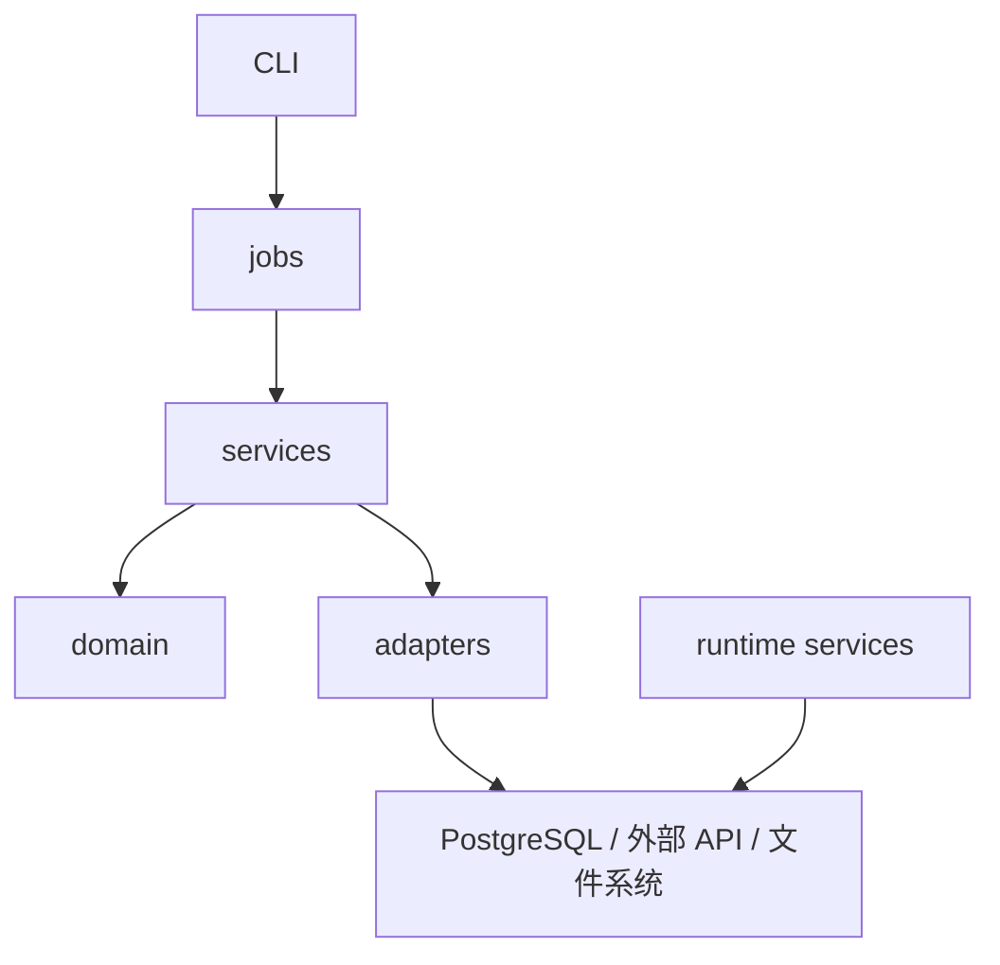

# 架构审查（当前状态）

## 总体判断

项目已经完成了从“脚本仓库”到“工程化研究平台”的主要转向。  
当前架构的核心特征是：

- 以 PostgreSQL 作为唯一事实源
- 以 `src/cli/*.py` 作为统一领域入口
- 以 `modules/*/{jobs,services,domain,adapters}` 形成主链
- 以 `etl_runs / etl_run_steps / dataset_versions` 接入运行治理
- 以 `dev` / `run` 支撑双机协作下的开发线与运行线分离

## 当前结构

## 当前优点

### 1. 入口层已经收口

- `collect / events / linking / graph / research / quality` 六大入口已经明确
- 用户入口 `./SPM` 已经成为稳定包装层
- 旧式任务编号语义基本退出主入口

### 2. 模块边界已基本清楚

- `collectors` 管采集与回填
- `events` 管事件标准化
- `companies` 与 `linking` 负责公司主数据与事件映射
- `graph` 负责传播与关系边
- `analysis` / `research` 负责研究数据生成
- `quality` 管质量与交付

### 3. 双机协作已经不是概念设计

- Intel 已能通过 TCP 直连 PostgreSQL
- 正文回填已在 Intel 上跑通
- M5 / Intel 环境职责已分层
- Git 已收敛到 `dev` / `run`

### 4. 运行治理已经进入主链

- `logged_run` 与 `logged_step` 已接入主要命令
- run metadata 不再只是文档规划，而是已开始真实落库

## 当前不足

### 1. 数据层成熟度仍不均衡

- `raw_documents -> event_candidates -> structured_events` 主链较清楚
- 但 `company_relations`、`event_propagation_edges` 的规模和成熟度仍偏初期
- `dataset_versions` 已有表结构，但使用深度仍不足

### 2. 正文资产仍未充分做实

- 2025-2026 的巨潮正文覆盖率目前仍不足一半
- 这直接影响事件抽取、摘要质量和训练样本质量

### 3. 研究层仍偏“研究底座早期”

- 已经有 `security_features_daily` 和 `security_forward_labels_daily`
- 但市场与基本面特征的覆盖面仍有增强空间

### 4. legacy 仍未完全退出

- `src/capabilities/*` 仍保留部分桥接逻辑
- 主链已在 `modules/*`，但仓库内部还没有完全消化干净

## 当前架构成熟度判断

| 维度 | 当前判断 |
|---|---|
| 入口层 | 成熟 |
| 模块边界 | 基本成熟 |
| 数据中心化 | 成熟 |
| 双机协作 | 已可用 |
| run metadata | 已落地但仍需深化 |
| 研究底座 | 初步可用 |
| 传播层 | 初步可用 |
| legacy 清理 | 未完成 |

## 近期最值得做的事

1. 持续提升 `raw_documents` 正文覆盖率
2. 把 `dataset_versions` 从“有表”推进到“日常真实使用”
3. 补足研究层点时特征
4. 扩大传播关系和公司关系层的可用规模
5. 继续压缩 `capabilities/*` 的桥接范围
