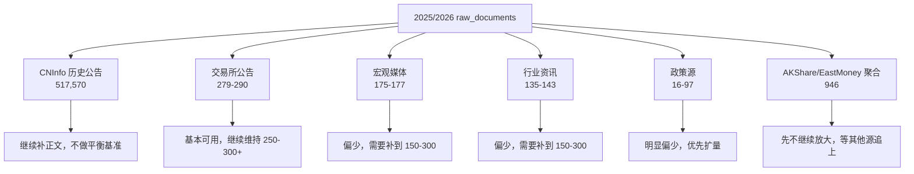
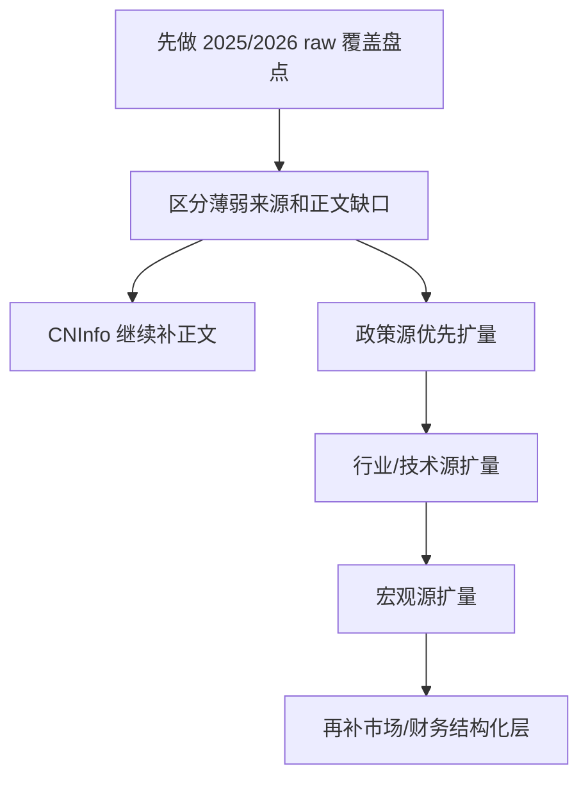

# 数据源扩展计划

> 基于当前 `stock_event_mining.raw_documents` 的真实来源分布，以及赛题附件 2 的来源建议整理。  
> 这一版只讨论 **raw 层覆盖**，不把事件分类结果当成回填前置条件。  
> 更新时间：`2026-04-23`

## 先说结论

我们当前的主线不是“围绕事件分类去补数”，而是：

1. **先把 2025/2026 的 raw documents 做厚**
2. **没有正文的优先补正文**
3. **除 CNInfo 历史公告外，让其他来源家族尽量进入相近量级**

也就是说，采集层的决策依据应该是：

- source-driven
- time-driven
- coverage-driven

而不是 classification-driven。

## 当前来源结构（2025/2026）

### 来源家族快照

| 来源家族 | 2025/2026 行数 | 合格正文行数 |
|---|---:|---:|
| CNInfo 历史公告 | 517,570 | 201,021 |
| AKShare/EastMoney 新闻聚合 | 946 | 0 |
| 深交所公告 | 290 | 0 |
| 上交所公告 | 279 | 0 |
| 财新网 | 177 | 0 |
| 第一财经 | 175 | 0 |
| CNInfo 最新公告 | 172 | 0 |
| 东方财富行业资讯 | 143 | 112 |
| 36氪 | 135 | 2 |
| 中国政府网 | 97 | 86 |
| 工信部 | 59 | 0 |
| 国家发改委 | 25 | 23 |
| 中国证监会 | 16 | 13 |
| 深交所停复牌 | 6 | 0 |

## 和附件 2 的对照

附件 2 推荐的事件来源大致分成四类：

1. 政策类
   - 中国政府网
   - 国家发改委
   - 证监会
2. 公司行为类
   - 巨潮资讯
   - 上交所
   - 深交所
3. 行业/技术类
   - 36 氪产业板块
   - 行业协会官网
   - 东方财富行业频道
4. 宏观/地缘类
   - 财新
   - 第一财经

当前覆盖结论：

| 类别 | 当前状态 | 说明 |
|---|---|---|
| 公司行为类 | 强覆盖 | 巨潮很强；上交所、深交所有基础量，但停复牌仍然薄 |
| 政策类 | 弱覆盖 | 中国政府网、工信部、国家发改委、证监会都已接入，但规模明显不足 |
| 行业/技术类 | 弱覆盖 | 东方财富较好，36 氪仍然偏弱 |
| 宏观/地缘类 | 弱覆盖 | 财新、第一财经已接入，但还没进入稳态规模 |

## 当前正文覆盖现实

围绕最重要的 `巨潮资讯网/历史公告`，当前正文状态是：

| 年份 | 总量 | 合格正文 |
|---|---:|---:|
| 2023 | 532,352 | 0 |
| 2024 | 525,197 | 0 |
| 2025 | 479,794 | 189,639 |
| 2026 | 37,776 | 11,382 |

这意味着：

- 2025/2026 继续回填正文仍然是主线
- 2023/2024 暂时冻结，不优先投入高成本补齐

## 2025/2026 采集目标

### 目标 1：CNInfo 历史公告只做正文提升

- 不拿它做“来源平衡”基准
- 只做一件事：**继续补正文**

### 目标 2：非 CNInfo 来源家族进入相近量级

建议目标带：

- **基础目标**：每个来源家族至少 `150` 条
- **稳态目标**：主要来源家族尽量进入 `150-300` 条区间

这条规则不包括：

- `CNInfo 历史公告`
- `AKShare/EastMoney 新闻聚合`

其中：
- `CNInfo 历史公告` 已经足够大，先只补正文
- `AKShare/EastMoney 新闻聚合` 已经远超其他非 CNInfo 源，先暂停继续放大

### 目标 3：政策源优先补量

当前最弱的是：

- 中国证监会
- 国家发改委
- 工信部
- 中国政府网

这几类是下一轮 raw 扩量的优先对象。

## 推荐扩展顺序

### P1 政策类来源

优先补：

- 中国政府网主政策流
- 国家发改委
- 证监会
- 工信部继续做厚

理由：

- 和当前 raw 层目标一致：数量和覆盖先补齐
- 对市场、行业、公司都能形成高价值事件文本
- 赛题附件 2 明确点名

### P2 行业/技术类来源

优先补：

- 东方财富行业频道
- 36 氪产业板块
- 2-3 个重点行业协会官网

理由：

- 这是当前最缺的行业驱动事件层
- 东方财富已经证明正文质量不错，36 氪需要继续做厚

### P3 宏观/地缘类来源

优先补：

- 财新
- 第一财经
- 再加一个稳定宏观源

理由：

- 对行业和市场面研究重要
- 当前覆盖有雏形，但规模明显不够

### P4 结构化市场/财务层

这不是文本源，但对研究上限同样关键：

- 停复牌事实层
- 财报事实层
- PE / PB / 总市值 / 流通市值 / 换手率
- 关键财务指标

理由：

- 当前 `security_features_daily` 的结构已经在，但字段覆盖仍然偏弱
- 不补这一层，事件研究很难走向更稳的量化研究

## 推荐落地方式

建议每新增一个来源，都同时明确：

1. `raw_documents.source` 的命名规范
2. 是否支持历史回填
3. 是否支持正文抽取
4. 是否需要专门的 canonical / linking 规则
5. 是否要进入长期主链，而不是一次性 CSV 导入

## 当前建议

接下来优先做的不是“一次性扩很多源”，而是：

1. 把 2025/2026 的巨潮正文继续做厚
2. 先把政策源补到 150+ 行
3. 再把行业源、宏观源补到 150-300 行
4. 让新增来源进入和现有主链一致的 `collect -> events -> linking` 流程

更细的来源能力与动作分工，见：

- [raw-source-capability-matrix.md](raw-source-capability-matrix.md)
