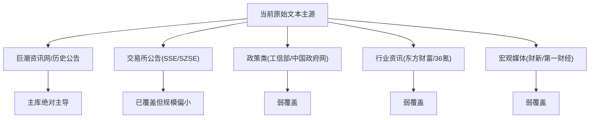
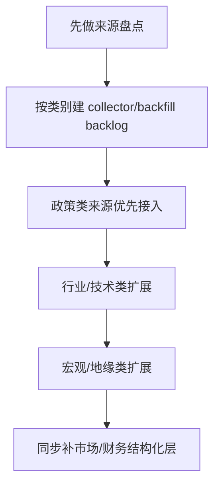

# 数据源扩展计划

> 基于当前 `stock_event_mining.raw_documents` 的真实来源分布，以及赛题附件 2 的来源建议整理。  
> 更新时间：`2026-04-23`

## 当前来源结构

当前原始文本库仍然被单一来源主导：

| 来源 | 当前条数 |
|---|---:|
| 巨潮资讯网/历史公告 | 1,575,119 |
| AKShare/EastMoney/证券时报网 | 480 |
| 深交所/上市公司公告 | 290 |
| 上交所/最新公告 | 278 |
| 财新网/mini | 176 |
| 第一财经/新闻 | 173 |
| 巨潮资讯网/最新公告 | 172 |
| 东方财富/行业资讯 | 142 |
| 36氪/股市快讯 | 134 |
| AKShare/EastMoney/每日经济新闻 | 83 |
| AKShare/EastMoney/中国证券报·中证网 | 64 |
| AKShare/EastMoney/财中社 | 61 |
| 工信部/政策文件 | 59 |
| 中国政府网/新华社 | 55 |

## 和附件 2 的对照

附件 2 推荐的事件来源大致分成四类：

1. 政策类
   - 中国政府网
   - 国家发改委
   - 证监会
2. 公司行为类
   - 巨潮资讯
   - 上交所
   - 深交所
3. 行业/技术类
   - 36 氪产业板块
   - 行业协会官网
   - 东方财富行业频道
4. 宏观/地缘类
   - 财新
   - 第一财经

当前覆盖结论：

| 类别 | 当前状态 | 说明 |
|---|---|---|
| 公司行为类 | 强覆盖 | 巨潮很强，上交所/深交所有但规模较小 |
| 政策类 | 弱覆盖 | 有工信部、中国政府网，但还没形成主链规模 |
| 行业/技术类 | 弱覆盖 | 东方财富和 36 氪有数据，但量薄且不稳定 |
| 宏观/地缘类 | 弱覆盖 | 财新、第一财经已接入，但远未成为主流来源 |

## 当前正文覆盖现实

围绕最重要的 `巨潮资讯网/历史公告`，当前正文状态是：

| 年份 | 总量 | 合格正文 |
|---|---:|---:|
| 2023 | 532,352 | 0 |
| 2024 | 525,197 | 0 |
| 2025 | 479,794 | 189,639 |
| 2026 | 37,776 | 11,382 |

这意味着：

- 2025/2026 继续回填正文仍然是主线
- 2023/2024 暂时可以冻结，不宜马上投入高成本补齐

## 推荐扩展顺序

### P1 政策类来源

优先补：

- 中国政府网主政策流
- 国家发改委
- 证监会
- 工信部继续做厚

理由：

- 和当前事件分类框架最兼容
- 对市场、行业、公司都能形成可研究事件
- 赛题附件 2 明确点名

### P2 行业/技术类来源

优先补：

- 东方财富行业频道
- 36 氪产业板块
- 2-3 个重点行业协会官网

理由：

- 这是当前最缺的行业驱动事件层
- 能补强政策公告之外的产业变化、技术突破、供需变化

### P3 宏观/地缘类来源

优先补：

- 财新
- 第一财经
- 再加一个稳定宏观源

理由：

- 对行业和市场面研究重要
- 当前覆盖有雏形，但规模明显不够

### P4 结构化市场/财务层

这不是文本源，但对研究上限同样关键：

- 停复牌事实层
- 财报事实层
- PE / PB / 总市值 / 流通市值 / 换手率
- 关键财务指标

理由：

- 当前 `security_features_daily` 的结构已经在，但字段覆盖仍然偏弱
- 不补这一层，事件研究很难走向更稳的量化研究

## 推荐落地方式

建议每新增一个来源，都同时明确：

1. `raw_documents.source` 的命名规范
2. 是否支持历史回填
3. 是否支持正文抽取
4. 是否需要专门的 canonical / linking 规则
5. 是否要进入长期主链，而不是一次性 CSV 导入

## 当前建议

接下来优先做的不是“一次性扩很多源”，而是：

1. 把 2025/2026 的巨潮正文继续做厚
2. 选 1 个政策源、1 个行业源、1 个宏观源做稳定接入
3. 让新增来源进入和现有主链一致的 `collect -> events -> linking` 流程
