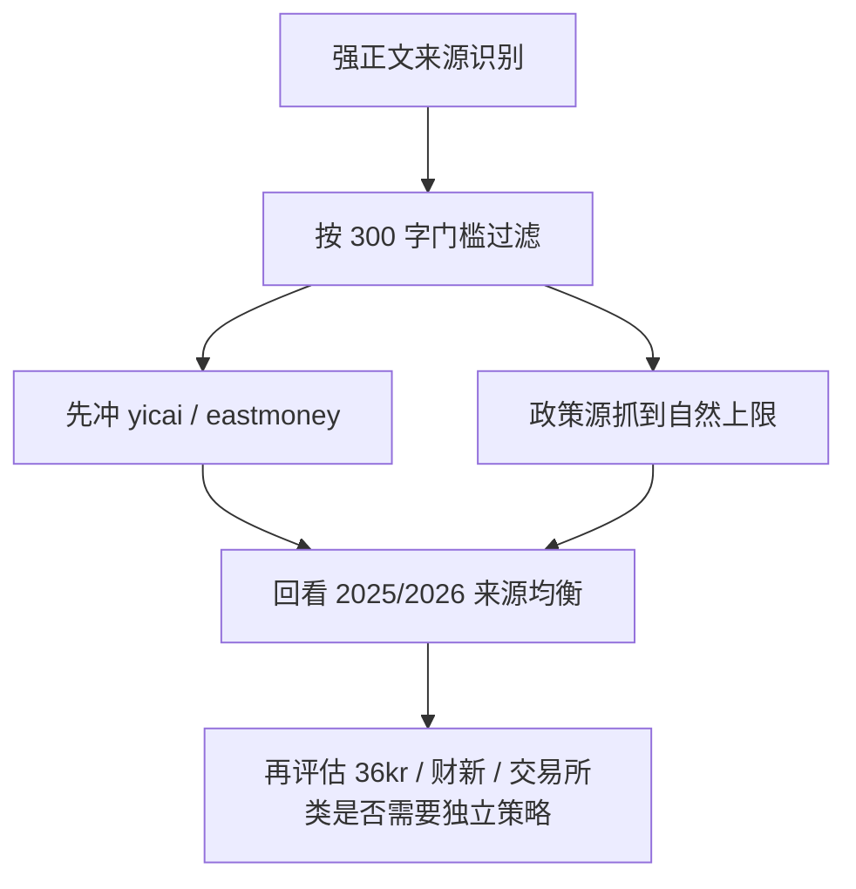

# 数据源扩展计划

> 基于当前 `stock_event_mining.raw_documents` 的真实来源分布，以及附件 2 的事件数据分类整理。  
> 本文只讨论 2025/2026 的 raw 层扩量与正文质量，不把事件分类结果当成采集前置条件。  
> 更新时间：`2026-04-23`

## 先说结论

对外的操作面现在应该尽量简单：

```bash
./SPM ingest full DB=stock_event_mining
./SPM status raw DB=stock_event_mining
```

系统内部仍然会区分来源能力，但这些规则不再要求操作时人工记忆。  
也就是说，后面我们可以继续维护“哪些来源适合冲量、哪些来源先跳过”的内部策略，但操作层只保留统一命令。

## 按附件 2 的真实框架看

附件 2 的顶层是：

1. 事件数据
2. 股市行情数据
3. 公司财务数据

我们当前这轮只全力优化的是 **事件数据 -> raw_documents**。

事件数据下面再分 4 类：

- `政策类事件`
- `公司行为事件`
- `行业/技术事件`
- `宏观/地缘事件`

当前 `raw_documents.symbol_or_subject` 就应该按这 4 类收口。`./SPM ingest full DB=stock_event_mining` 会在补数据和补正文之后自动执行这一步，所以 raw 层扩量和粗分类治理走同一个主命令。

采集来源的默认页数、并发、正文门槛、附件 2 粗分类都集中在 `src/modules/collectors/domain/source_profiles.py`。新增来源时优先补 source profile，再接 adapter / history 主链。

## 当前来源分层

### A. 当前会被 `ingest full` 优先按正文质量推进的来源

这些来源已经在 DB 或抽样验证里证明了自己能产出 `length(content) >= 300` 的正文：

| history source | 事件粗分类 | 当前状态 |
|---|---|---|
| `gov-news` | 政策类事件 | 已在 DB 中验证强正文 |
| `ndrc-policy` | 政策类事件 | 已在 DB 中验证强正文 |
| `csrc-policy` | 政策类事件 | 已在 DB 中验证强正文 |
| `miit-policy` | 政策类事件 | 已在抽样中验证强正文 |
| `eastmoney-industry` | 行业/技术事件 | 已在 DB 中验证强正文 |
| `yicai-news` | 宏观/地缘事件 | 已在抽样中验证强正文 |

### B. 当前会被 `ingest full` 以“覆盖优先”方式处理的来源

这些来源虽然已经进了主链，但当前更适合先补覆盖，不适合强行按正文型目标处理：

| history source | 当前问题 |
|---|---|
| `kr36-flash` | 快讯型文本偏短，300 字门槛通过率很低 |
| `caixin-mini` | 一部分详情页可读，但整体命中率偏低 |
| `sse-announcements` | 更像结构化公告摘要，不是正文型源 |
| `szse-announcements` | 更像结构化公告摘要，不是正文型源 |
| `szse-suspension` | 事实型停复牌，不是正文型源 |
| `akshare-news` | 聚合新闻量大，但正文质量不稳定 |

## 2025/2026 的扩量策略

虽然内部还是按来源能力分组，但这个分组的作用是：

- 决定 `ingest full` 对不同来源采用哪种补数据方式
- 决定 `status raw` 该显示什么理由

而不是让日常操作去背一堆来源规则

### 第一组：正文优先、继续做厚的来源

优先尝试：

1. `yicai-news`
2. `eastmoney-industry`

这两类最像“有机会既保质量，又把量做大”的来源。

### 第二组：正文优先、抓到自然上限的政策源

继续稳定补齐：

1. `gov-news`
2. `ndrc-policy`
3. `csrc-policy`
4. `miit-policy`

这些来源的质量好，但 2025/2026 的自然供给量有限，更现实的目标是：

- 抓到上限
- 保证 `content` 都是强正文

而不是机械追求每个来源都达到同一个固定行数。

### 第三组：覆盖优先、暂不强行按正文型目标推进

- `kr36-flash`
- `caixin-mini`
- `sse-announcements`
- `szse-announcements`
- `szse-suspension`
- `akshare-news`

这些来源要么内容短，要么本来就不是正文型来源。

## 为什么先不继续碰巨潮正文

这不是因为巨潮不重要，而是因为你当前主线已经切成了：

- **先做非巨潮多源 raw 扩量**
- **优先把强正文来源拉起来**
- **巨潮先不参与“多源平衡”**

所以接下来 raw 层最自然的动作是：

1. 把非巨潮强正文源先做厚
2. 再回头决定什么时候继续巨潮全文回填

## 推荐执行顺序



## 现在的实际动作

### 直接继续做

- `yicai-news`
- `eastmoney-industry`
- `gov-news`
- `ndrc-policy`
- `csrc-policy`
- `miit-policy`

### 先不要混进“正文优先补数据”主线

- `kr36-flash`
- `caixin-mini`
- `sse-announcements`
- `szse-announcements`
- `szse-suspension`

## 配套文档

- [raw-source-capability-matrix.md](raw-source-capability-matrix.md)
