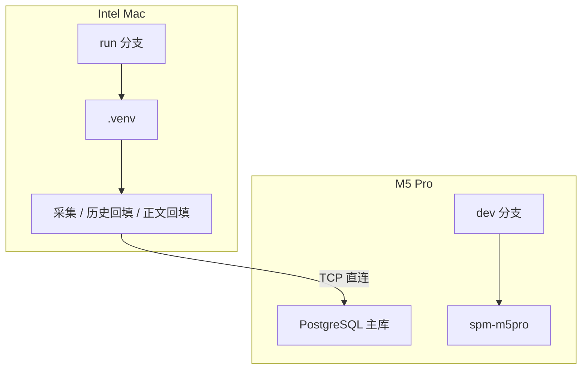

# 运行与运维手册

这份文档记录的是**当前双机协作体系下的日常操作手册**，目标是让系统在不依赖临时记忆的情况下也能稳定运行。

## 一、当前正式运行模式



当前默认口径：

- **M5 Pro**：数据库主机、开发机、研究机
- **Intel Mac**：执行机、采集机、正文回填机
- **当前正式模式不依赖外接 SSD**
- **数据库事实源只有一个：`stock_event_mining`**

## 二、每天的标准启动顺序

### 1. M5 Pro

```bash
cd /Users/tim/股市预测模型
conda activate spm-m5pro
brew services start postgresql@15
python3 src/cli/quality.py db --db stock_event_mining
```

说明：

- `collect.py` 的采集与正文回填命令现在会在**当前进程内**临时清除 `HTTP_PROXY / HTTPS_PROXY / ALL_PROXY` 等代理变量
- 这不会修改你的系统网络环境，只是保证国内站点采集默认直连
- `events.py run` 在未开启 `--skip-collect` 时，也会沿用同样的默认行为

确认点：

- PostgreSQL 已启动
- `spm-m5pro` 环境可用
- `db` 可以正常返回核心表规模

### 2. Intel Mac

```bash
cd ~/Desktop/SPM
git fetch origin --prune
git switch run
git reset --hard origin/run
source .venv/bin/activate
```

然后确认数据库连接参数：

```bash
export PGHOST=<M5_IP>
export PGPORT=5432
export PGUSER=collector_runner
export PGPASSWORD='<password>'
export PGDATABASE=stock_event_mining
export PGSSLMODE=disable
export PGGSSENCMODE=disable
export PGCONNECT_TIMEOUT=3
```

连通性验证：

```bash
psql -d stock_event_mining -c "select current_database(), current_user, now();"
```

## 三、代码同步规则

### M5 Pro

M5 永远在 `dev` 上开发：

```bash
cd /Users/tim/股市预测模型
git switch dev
git pull --ff-only origin dev
```

### Intel Mac

Intel 永远跑 `run`：

```bash
cd ~/Desktop/SPM
git fetch origin --prune
git switch run
git reset --hard origin/run
```

### 发布新运行代码

当 M5 上的 `dev` 已验证稳定后，再发布给 Intel：

```bash
cd /Users/tim/股市预测模型
git branch -f run dev
git push origin run
```

## 四、常用运行命令

### 1. Intel：历史采集

```bash
python src/cli/collect.py collect-history \
  --db stock_event_mining \
  --source cninfo-disclosure \
  --start-date 2025-01-01 \
  --end-date 2025-01-07 \
  --max-symbols 3 \
  --limit-per-symbol 5 \
  --workers 2 \
  --db-flush-every 20
```

### 2. Intel：正文回填

#### 2025 全量风格

```bash
python src/cli/collect.py backfill-cninfo-fulltext \
  --db stock_event_mining \
  --start-date 2025-01-01 \
  --end-date 2026-01-01 \
  --max-rows 5000 \
  --workers 2 \
  --db-flush-every 100
```

#### 小样本验证

```bash
python src/cli/collect.py backfill-cninfo-fulltext \
  --db stock_event_mining \
  --start-date 2025-01-01 \
  --end-date 2026-01-01 \
  --max-rows 100 \
  --workers 1 \
  --db-flush-every 20
```

### 3. M5：事件与研究

```bash
python3 src/cli/events.py run --db stock_event_mining --limit 8
python3 src/cli/linking.py run --db stock_event_mining --top-k 3 --min-score 0.35
python3 src/cli/graph.py run --db stock_event_mining --input output/seeds/company_relations_seed.csv
python3 src/cli/research.py feature --db stock_event_mining --analysis-mode event-study --benchmark hs300
python3 src/cli/research.py train --db stock_event_mining --label-dataset output/event_return_dataset.csv
python3 src/cli/quality.py summary --db stock_event_mining
```

## 五、日常检查项

### 1. 数据库总体状态

```bash
python3 src/cli/quality.py db --db stock_event_mining
```

### 2. 2025-2026 正文覆盖率

```bash
psql -d stock_event_mining -c "
select
  count(*) as total_rows,
  count(*) filter (where content is not null and length(trim(content)) > 50) as filled_rows,
  round(100.0 * count(*) filter (where content is not null and length(trim(content)) > 50) / nullif(count(*),0), 2) as fill_rate_pct
from raw_documents
where publish_time >= '2025-01-01'
  and publish_time < '2027-01-01'
  and source = '巨潮资讯网/历史公告';
"
```

### 3. 近期 run metadata

```bash
psql -d stock_event_mining -c "
select run_id, command_group, command_name, status, started_at, finished_at
from etl_runs
order by started_at desc
limit 20;
"
```

### 4. 最近失败运行

```bash
psql -d stock_event_mining -c "
select run_id, command_group, command_name, error_message, started_at
from etl_runs
where status = 'failed'
order by started_at desc
limit 20;
"
```

## 六、故障排查

### 1. Intel 连不上数据库

先查：

```bash
ping -c 3 <M5_IP>
nc -vz -G 3 <M5_IP> 5432
psql -d stock_event_mining -c "select now();"
```

如果 `ping` 通但 `psql` 不通，优先检查：

- PostgreSQL 是否启动
- `pg_hba.conf` 是否放行 Intel IP
- 当前校园网 / 热点是否改变了网段

### 2. Intel 回填启动时报权限问题

现行正确状态下不应该再出现：

- `permission denied for schema public`
- `must be owner of table etl_runs`

如果再次出现，优先检查：

- Intel 是否已更新到最新 `origin/run`
- M5 是否仍保留治理表
- 连接用户是否仍是 `collector_runner`

### 3. Intel 缺少依赖

建议先确认：

```bash
source .venv/bin/activate
python src/cli/collect.py --help
```

然后只补最小采集依赖：

```bash
uv pip install requests aiohttp akshare pandas psycopg pdfplumber python-dotenv beautifulsoup4 lxml openpyxl html5lib
```

## 七、运维原则

1. M5 负责“开发和研究”，Intel 负责“执行和补数”
2. `run` 只放已验证过的代码，不拿 Intel 直接试 `dev`
3. 数据库是事实源，`output/` 不是事实源
4. 先保证链路稳定，再扩大参数规模
