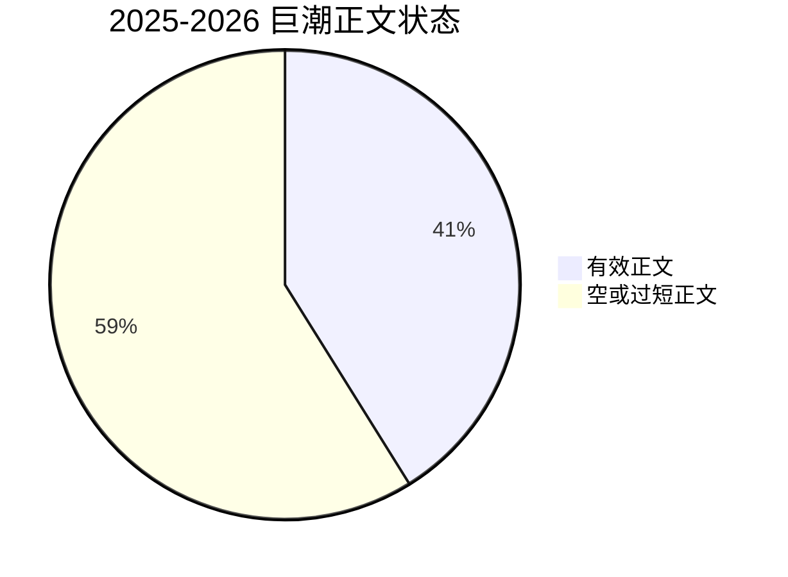

# 项目状态总览

更新时间：`2026-04-23`

## 总结

当前项目已经具备稳定的工程主干：

- 以 `stock_event_mining` 为唯一数据库事实源
- 以 `dev` / `run` 两分支支撑开发与运行分离
- 以 `M5 Pro + Intel Mac` 支撑双机协作
- 以 `etl_runs / etl_run_steps / dataset_versions` 支撑运行治理
- 以 `psycopg` 事务边界保障事件 stage/final 落库原子性

但项目仍处于“数据底座持续做实”的阶段，最主要的工作仍是：

1. 持续做厚 2025/2026 的 raw_documents
2. 用 source profile 集中管理不同来源的正文与覆盖策略
3. 继续补齐研究底座的点时特征与标签

## 状态看板

| 项目面向 | 当前状态 | 判断 |
|---|---|---|
| 数据采集 | 可用 | 所有现有 adapter 已接入 `collect-history` 主链 |
| 正文抽取 | 可用但分层明显 | 政策源、东方财富、第一财经、工信部已具备正文能力；交易所和部分媒体偏覆盖型 |
| 事件标准化 | 可用 | 候选事件和结构化事件主链已成形 |
| 事件-公司关联 | 可用 | 主链命令已稳定存在 |
| 传播图谱 | 初步可用 | 仍偏轻量，图关系规模不大 |
| 研究样本 | 初步可用 | 已能生成样本，但规模和字段还可继续补强 |
| 运行治理 | 已建立 | run metadata 与 dataset lineage 已接入主链 |
| 双机协作 | 已跑通 | TCP 直连 PostgreSQL 已验证成功 |
| 事件落库一致性 | 已加强 | stage 装载与 final load 已收敛到单事务边界 |

## 核心数据库快照

来自 `stock_event_mining` 当前快照：

| 表 | 行数 |
|---|---:|
| `raw_documents` | 1,581,500 |
| `event_candidates` | 1,577,638 |
| `structured_events` | 370,135 |
| `canonical_event_clusters` | 106,760 |
| `canonical_event_memberships` | 332,660 |
| `company_relations` | 205 |
| `company_profiles` | 136 |
| `stock_daily_quotes` | 78,596 |
| `market_environment_daily` | 1,494 |
| `sentiment_propagation_daily` | 428 |
| `security_features_daily` | 78,770 |
| `security_forward_labels_daily` | 78,770 |
| `event_research_samples` | 538 |
| `control_research_samples` | 36,377 |
| `etl_runs` | 48 |
| `etl_run_steps` | 8 |
| `dataset_versions` | 0 |

## 2025-2026 raw 第一层状态

### raw 总体快照

| 指标 | 数值 |
|---|---:|
| `raw_documents` 总量 | 1,581,500 |
| 最早 `publish_time` | 2023-01-03 00:00:00 |
| 最晚 `publish_time` | 2026-04-23 16:30:07 |
| 未来日期记录 | 0 |

### 2025-2026 来源家族快照

| 来源家族 | 行数 | 合格正文 | 强正文 |
|---|---:|---:|---:|
| 巨潮资讯网 | 517,743 | 201,952 | 201,021 |
| 深交所 | 2,097 | 206 | 0 |
| 上交所 | 1,279 | 202 | 0 |
| AKShare | 946 | 847 | 0 |
| 第一财经 | 655 | 42 | 0 |
| 中国政府网 | 383 | 370 | 303 |
| 中国证监会 | 198 | 178 | 160 |
| 财新网 | 186 | 66 | 0 |
| 东方财富 | 170 | 161 | 132 |
| 36氪 | 155 | 103 | 2 |
| 国家发改委 | 73 | 73 | 67 |
| 工信部 | 65 | 0 | 0 |

### raw 粗分类口径

`raw_documents.symbol_or_subject` 现在统一按附件 2 的四类事件数据口径治理：

- `政策类事件`
- `公司行为事件`
- `行业/技术事件`
- `宏观/地缘事件`

`./SPM ingest full DB=stock_event_mining` 会在补来源和补正文之后自动执行规范化。这个步骤只更新 `symbol_or_subject`，不改正文、不改 URL、不改发布时间。

### 强正文当前结论

- 已在 DB 中证明强正文能力：
  - `gov-news`
  - `ndrc-policy`
  - `csrc-policy`
  - `eastmoney-industry`
- 已在抽样中证明强正文能力，但还没大规模回写主库：
  - `miit-policy`
  - `yicai-news`
- 当前更适合先补覆盖、再视详情页能力提升正文质量：
  - `kr36-flash`
  - `caixin-mini`
  - `sse-announcements`
  - `szse-announcements`
  - `szse-suspension`

## 2025-2026 巨潮正文状态

| 指标 | 数值 |
|---|---:|
| 2025-2026 巨潮历史公告总量 | 517,570 |
| 已回填有效正文 | 212,842 |
| 回填覆盖率 | 41.12% |
| 命中 `12000` 字上限 | 17,903 |

### 正文长度分布

| 分位点 | 长度 |
|---|---:|
| 最小值 | 51 |
| P25 | 1,324 |
| 中位数 | 2,839 |
| P75 | 5,240 |
| P95 | 12,000 |
| 最大值 | 12,000 |

这说明：

- 大部分已抽取正文不是空壳
- 但一部分文档被当前 `12000` 字上限截断
- 覆盖率仍明显低于最终可接受水平

这说明当前 raw 层的主要问题已经很明确：

1. `CNInfo 历史公告` 仍然是绝对主源
2. 非巨潮来源已经形成第二梯队，但还没有真正拉齐
3. 继续扩量时由 source profile 内部区分正文优先和覆盖优先

## 环境状态

### M5 Pro

| 项目 | 当前状态 |
|---|---|
| 主角色 | 数据库主库、开发、清洗、研究、训练 |
| Python 环境 | `spm-m5pro` |
| 环境管理 | Conda |
| 环境定义文件 | [environment.m5pro.yml](../../environment.m5pro.yml) |

### Intel Mac

| 项目 | 当前状态 |
|---|---|
| 主角色 | 采集、历史回填、正文回填 |
| Python 环境 | 仓库内 `.venv` |
| 环境管理 | `venv` + `uv` |
| 依赖策略 | 最小采集依赖，不强行安装全量研究依赖 |

## Git 状态

| 项目 | 当前状态 |
|---|---|
| 主开发分支 | `dev` |
| 主运行分支 | `run` |
| 当前发布状态 | `run` 与 `dev` 当前同步 |
| 远端分支 | `origin/dev`, `origin/run` |
| 已清理分支 | `main`, `backup/run-pre-sync-20260404` |

## 当前最重要的结论

### 已经成立的事实

- Intel 已能通过 TCP 直连 M5 上 PostgreSQL
- Intel 已能在 `run` 分支执行采集与正文回填
- `collector_runner` 已能正常写运行元数据，不再被 owner-only DDL 卡住
- 项目环境已经分层：M5 负责全量研究环境，Intel 负责轻量运行环境
- `events` 的 stage 装载与 final load 已不再依赖多次独立 `psql -c` 提交

### 还未完成的事情

- 2025-2026 非巨潮来源仍未完全拉齐
- `miit-policy / yicai-news` 的新正文抽取能力还需要继续回写到主库规模
- `dataset_versions` 尚未形成稳定产物登记规模
- 传播图谱与研究样本层仍有进一步扩展空间
- 市场与基本面维度仍需要继续补齐
- `run` 分支当前已和 `dev` 对齐，Intel 拉取 `origin/run` 时可以拿到当前主线修复

## 当前建议

### 短期

1. 继续扩量 `yicai-news / eastmoney-industry`
2. 把 `gov-news / ndrc-policy / csrc-policy / miit-policy` 抓到自然上限
3. 持续观察 `etl_runs` 与 `etl_run_steps` 的 run 记录完整性

### 中期

1. 继续把 source profile 做成 raw 层唯一采集规则入口
2. 扩展 `security_features_daily` 的研究字段
3. 增强 `company_relations` 和 `event_propagation_edges` 的规模与质量

### 长期

1. 形成更稳定的研究训练数据集版本体系
2. 建立更明确的迁移治理和调度治理
3. 让双机协作从“可用”提升到“长期稳定运行”
